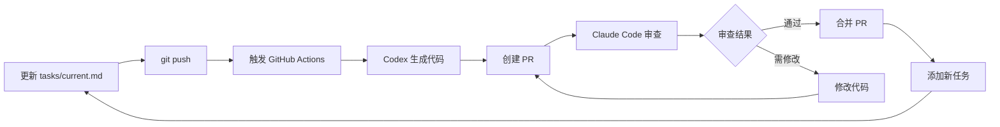

# 🤖 LeetCode AI 自动化练习系统

> Codex (云端) 自动完成算法题 → Claude Code (本地) 审查代码 → 循环迭代

[](https://github.com/xiaozhi/ai-demo/actions)
[](https://opensource.org/licenses/MIT)

## 📋 目录

- [快速开始](#快速开始)
- [项目结构](#项目结构)
- [工作流程](#工作流程)
- [使用指南](#使用指南)
- [配置说明](#配置说明)
- [故障排查](#故障排查)

## 🚀 快速开始

### 1. 配置 GitHub Secrets

在 GitHub 仓库的 `Settings → Secrets and variables → Actions` 中添加：

| Secret Name | Description | Required |
|-------------|-------------|----------|
| `OPENAI_API_KEY` | OpenAI API 密钥 | ✅ |
| `PAT_TOKEN` | GitHub Personal Access Token | ⚪️ 可选 |

### 2. 启用 GitHub Actions

1. 进入仓库的 `Actions` 标签页
2. 点击 `I understand my workflows, go ahead and enable them`

### 3. 配置 PR 创建权限

`Settings → Actions → General → Workflow permissions`:

- ✅ Read and write permissions
- ✅ Allow GitHub Actions to create and approve pull requests

### 4. 创建 GitHub 标签（可选但推荐）

标签用于自动标记和过滤 Codex 生成的 PR。

```bash
# 运行标签创建脚本
./.github/scripts/create-labels.sh
```

或者手动在 GitHub UI 中创建以下标签：
- `codex-generated` (绿色 #0E8A16) - Codex 自动生成的 PR
- `test-failed` (红色 #D93F0B) - 测试失败的 PR
- `claude-reviewed` (蓝色 #1D76DB) - Claude Code 已审查
- `ready-to-merge` (蓝色 #0075CA) - 准备合并

**注意**：即使不创建标签，系统仍然可以正常工作，只是无法通过标签过滤 PR。

### 5. 安装依赖

```bash
npm install
```

## 📁 项目结构

```
.
├── ai-config/              # 🤖 AI 相关配置（Codex + Claude）
│   ├── codex/             # Codex 配置和提示词
│   │   ├── system-prompt.md    # Codex 系统提示词
│   │   ├── workflow.md         # Codex 工作流说明
│   │   └── pr-template.md      # PR 模板
│   └── claude/            # Claude Code 配置
│       ├── review-guide.md     # 代码审查指南
│       └── commands.md         # 常用命令参考
│
├── .github/               # GitHub Actions 工作流
│   └── workflows/
│       ├── codex-worker.yml    # Codex 自动化工作流
│       └── claude-review.yml   # Claude 审查触发器
│
├── src/                   # 💼 业务代码
│   ├── problems/          # LeetCode 题目实现
│   │   ├── example-template.ts # 代码模板示例
│   │   └── README.md           # 目录说明
│   └── utils/             # 工具函数
│       └── test-runner.ts      # 测试运行器
│
├── tasks/                 # 📝 任务管理
│   ├── current.md         # 当前任务（修改此文件触发 Codex）
│   ├── queue.md           # 任务队列
│   ├── completed.md       # 已完成任务
│   └── template.md        # 任务模板
│
├── docs/                  # 📚 文档
│
└── package.json           # 项目配置
```

### 设计理念

项目结构遵循 **关注点分离** 原则：

- **`ai-config/`**: 所有 AI 相关的配置、提示词、工作流说明集中管理
- **`src/`**: 纯业务代码，与 AI 配置解耦
- **`tasks/`**: 任务管理独立目录，清晰追踪进度
- **`.github/`**: CI/CD 配置标准位置

## 🔄 工作流程



### 详细步骤

1. **添加任务**
   - 编辑 [`tasks/current.md`](tasks/current.md) 添加新的 LeetCode 题目
   - 推送到 GitHub：`git push`

2. **Codex 自动执行**
   - GitHub Actions 自动触发
   - Codex 读取任务，生成代码
   - 在 `src/problems/` 创建题目文件
   - 自动创建 PR

3. **Claude Code 审查**
   - 在新的 Claude Code 会话中运行：
     ```bash
     gh pr list --label "codex-generated"
     gh pr checkout <PR_NUMBER>
     ```
   - 参考 [`ai-config/claude/review-guide.md`](ai-config/claude/review-guide.md) 进行审查
   - 批准或请求修改

4. **合并并继续**
   - 审查通过后合并 PR
   - 更新 [`tasks/completed.md`](tasks/completed.md)
   - 从 [`tasks/queue.md`](tasks/queue.md) 选择下一个任务

## 📖 使用指南

### 添加新任务

1. 从 [`tasks/queue.md`](tasks/queue.md) 选择任务
2. 复制 [`tasks/template.md`](tasks/template.md) 内容到 [`tasks/current.md`](tasks/current.md)
3. 填写题目详情
4. 提交并推送：
   ```bash
   git add tasks/current.md
   git commit -m "task: add LeetCode #1 Two Sum"
   git push
   ```

### 审查 Codex 生成的代码

在 Claude Code CLI 中：

```bash
# 查看待审查的 PR
gh pr list --label "codex-generated"

# 检出 PR
gh pr checkout <PR_NUMBER>

# 查看改动
gh pr diff <PR_NUMBER>

# 运行测试
npm test

# 批准 PR
gh pr review <PR_NUMBER> --approve --body "✅ LGTM!"

# 合并 PR
gh pr merge <PR_NUMBER> --squash --delete-branch
```

或者直接在 Claude Code 中说：
- "审查最新的 PR"
- "检查 PR #123"
- "批准通过测试的 PR"

### 手动触发 Codex

如果自动触发失败，可以手动触发：

1. 进入 `Actions` 标签页
2. 选择 `Codex Worker`
3. 点击 `Run workflow`

## ⚙️ 配置说明

### Codex 配置

配置文件位于 [`ai-config/codex/`](ai-config/codex/)：

- **`system-prompt.md`**: Codex 的系统提示词，定义代码生成规范
- **`workflow.md`**: Codex 工作流详细说明
- **`pr-template.md`**: 自动创建 PR 的模板

### Claude Code 配置

配置文件位于 [`ai-config/claude/`](ai-config/claude/)：

- **`review-guide.md`**: 代码审查指南和检查清单
- **`commands.md`**: 常用命令速查表

### 自定义代码生成规范

编辑 [`ai-config/codex/system-prompt.md`](ai-config/codex/system-prompt.md) 可以自定义：

- 文件命名规则
- 代码结构模板
- 注释风格
- 测试用例格式

## 🔧 故障排查

### 常见问题快速解决

#### ❌ Error: could not add label: 'codex-generated' not found

**快速解决**：
```bash
# 运行标签创建脚本
./.github/scripts/create-labels.sh
```

标签不存在不会影响系统运行，只是无法通过标签过滤 PR。详见 [完整故障排查指南](docs/TROUBLESHOOTING.md#标签相关问题)。

#### ❌ Actions 未触发

**检查项**：
- [ ] `tasks/current.md` 已推送到 `main` 分支
- [ ] GitHub Actions 已启用
- [ ] Secrets 配置正确（`OPENAI_API_KEY`）

**解决方案**：
```bash
# 检查最近的 workflow 运行
gh run list --workflow=codex-worker.yml

# 查看失败日志
gh run view <RUN_ID> --log
```

#### ❌ PR 创建失败

**检查项**：
- [ ] Workflow permissions 已正确配置
- [ ] 允许 Actions 创建 PR

**解决方案**：
1. 进入 `Settings → Actions → General`
2. 确保勾选：
   - ✅ Read and write permissions
   - ✅ Allow GitHub Actions to create and approve pull requests

### 测试失败？

**检查代码**：
```bash
# 检出失败的 PR
gh pr checkout <PR_NUMBER>

# 本地运行测试
npm test

# 查看详细错误
npm run test:single "src/problems/<file-name>.ts"
```

### OpenAI API 调用失败？

**可能原因**：
- API Key 无效或过期
- 请求频率超限
- 网络问题

**解决方案**：
1. 检查 Secret 中的 `OPENAI_API_KEY` 是否正确
2. 查看 Actions 日志中的具体错误信息
3. 手动重新触发 workflow

---

**📖 更多问题？** 查看 [完整故障排查指南](docs/TROUBLESHOOTING.md) 获取详细解决方案。

## 📊 统计和监控

### 查看进度统计

```bash
# 查看已完成任务数
cat tasks/completed.md

# 运行统计脚本（如果有）
npm run stats
```

### 监控 PR 状态

```bash
# 实时监控 PR 列表
watch -n 10 'gh pr list --label "codex-generated"'

# 查看所有待审查的 PR
gh pr list --label "codex-generated" --state open
```

## 🤝 贡献指南

欢迎贡献！请遵循以下步骤：

1. Fork 本仓库
2. 创建特性分支：`git checkout -b feature/amazing-feature`
3. 提交更改：`git commit -m 'Add amazing feature'`
4. 推送分支：`git push origin feature/amazing-feature`
5. 创建 Pull Request

## 📄 许可证

本项目采用 MIT 许可证 - 查看 [LICENSE](LICENSE) 文件了解详情。

## 🙏 致谢

- [OpenAI](https://openai.com/) - Codex API
- [Anthropic](https://anthropic.com/) - Claude Code
- [LeetCode](https://leetcode.com/) - 算法题库

---

**快速链接**：
- [AI 配置说明](ai-config/)
- [任务管理](tasks/)
- [代码实现](src/problems/)
- [GitHub Actions](.github/workflows/)
- [完整故障排查指南](docs/TROUBLESHOOTING.md)
- [详细设置指南](docs/SETUP.md)
- [架构文档](docs/ARCHITECTURE.md)

有问题？[提交 Issue](https://github.com/xiaozhi/ai-demo/issues)
